# Análisis de Telecomunicaciones - Informe EDA

Este documento README proporciona un resumen del análisis exploratorio de datos (EDA) realizado para una empresa prestadora de servicios de telecomunicaciones. El objetivo del análisis fue comprender el comportamiento del sector a nivel nacional y proporcionar información relevante para mejorar la calidad de los servicios, identificar oportunidades de crecimiento y plantear soluciones personalizadas a posibles clientes. A continuación, se presentan los principales hallazgos y los indicadores clave de rendimiento (KPI) derivados del análisis.

---

## Contexto

La empresa prestadora de servicios de telecomunicaciones encomendó la realización de un análisis completo para comprender el comportamiento del sector a nivel nacional. La empresa se enfoca en brindar acceso a internet, pero también es importante considerar el comportamiento asociado con otros servicios de comunicación. El análisis tiene como objetivo orientar a la empresa en la mejora de la infraestructura, ampliar la conectividad y desarrollar estrategias de venta.

---

## Conjunto de Datos Utilizados

### Se utilizaron los siguientes conjuntos de datos en este análisis:

* Penetración de internet fijo - Acceso por cada 100 hogares. [Datos](https://datosabiertos.enacom.gob.ar/visualizations/32226/penetracion-de-internet-fijo-accesos-por-cada-100-hogares/)
* Penetración de internet fijo - Nivel Nacional. [Datos](https://datosabiertos.enacom.gob.ar/visualizations/29883/penetracion-por-hogares-nacional-de-internet-fijo/)
* Accesos por banda ancha fija y angosta a nivel nacional. [Datos](https://datosabiertos.enacom.gob.ar/dataviews/240976/total-nacional-de-accesos-a-internet-fijo-por-banda-ancha-y-banda-angosta/)
* Accesos a internet por banda ancha fija y angosta por provincia. [Datos](https://datosabiertos.enacom.gob.ar/dataviews/240974/accesos-a-banda-ancha-y-banda-angosta-por-provincia/)
* Velocidad de Internet. [Datos](https://datosabiertos.enacom.gob.ar/visualizations/31361/velocidad-media-de-bajada-de-internet-fijo/)
* Velocidad de bajada por provincia. [Datos](https://datosabiertos.enacom.gob.ar/dataviews/248812/accesos-a-internet-fijo-por-velocidad-bajada-y-provincia/)
* Tecnologías para el acceso a internet fijo por provincia. [Datos](https://datosabiertos.enacom.gob.ar/dataviews/240898/acceso-a-internet-fijo-por-tecnologia-y-provincia/)
* Ingresos por la prestación del servicio. [Datos](https://datosabiertos.enacom.gob.ar/visualizations/29879/ingresos-trimestrales-por-la-prestacion-del-servicio-de-internet-fijo/)
* Censo Hogares 2022 - Instituto Nacional de Estadística y Censos República Argentina. [Datos](https://www.indec.gob.ar/indec/web/Nivel4-Tema-2-41-165)
* Penetración total nacional de TV por Suscripción. [Datos](https://datosabiertos.enacom.gob.ar/visualizations/29985/total-nacional-de-accesos-a-television-por-suscripcion-y-television-satelital/)

---

## Hallazgos y KPIs

A continuación, se presentan los principales hallazgos y los indicadores clave de rendimiento (KPI) derivados del análisis realizado:

### * **Penetración de internet por provincia**

   - Se identificaron 17 provincias con una penetración de internet inferior al 60%.
   - Estas provincias representan oportunidades de crecimiento en términos de mejora de infraestructura, ampliación de la conectividad y desarrollo de estrategias de venta.
   - El promedio de penetración de las 17 provincias es del 39%.

   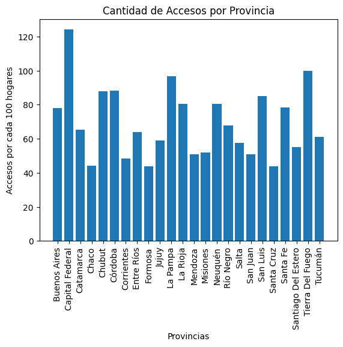
   Oportunidades de crecimiento en la venta de servicios de Internet Fijo en las diferentes provincias de Argentina.

   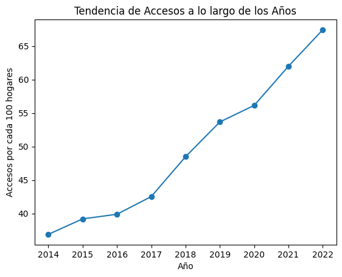 Tenemos una tendencia de Accesos a Internet Fijo siempre en crecimiento.

   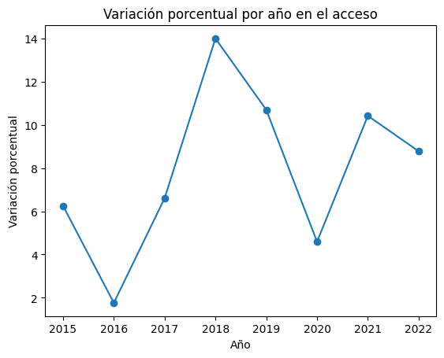 En términos de crecimiento porcentual año a año se observa el mayor pico en 2018 en un 14%, una posterior caída cerca al 4% y una recuperación en pandemia hasta casi superar el 10% de crecimiento en 2021. En promedio, la penetración ha crecido al 7.8% anual

El análisis reveló que existen 17 provincias en Argentina con una penetración de internet inferior al 60%. Estas provincias representan oportunidades de crecimiento para la empresa, ya que sugieren la necesidad de mejorar la infraestructura, ampliar la conectividad y desarrollar estrategias de venta adaptadas a cada región. El promedio de penetración en estas 17 provincias es del 39%, lo que indica un margen significativo para el crecimiento y la expansión de los servicios de internet.

### * **Acceso a Internet por Banda Ancha Fija y Dial Up**

- Porcentaje de acceso a Internet por Banda Ancha Fija en Argentina: 99.72%
- Porcentaje de acceso a Internet por Dial Up en Argentina: 0.24%

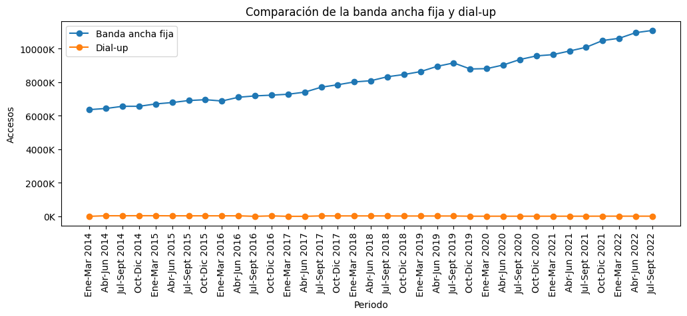 El acceso por Banda Ancha Fija en Argentina corresponde al: 99.72 
 El acceso por Dial up en Argentina corresponde al: 0.24

Los resultados muestran que el acceso a internet por banda ancha fija en Argentina es muy alto, alcanzando el 99.72%. Por otro lado, el acceso por Dial Up es prácticamente nulo, representando solo el 0.24%. Estos datos confirman la preferencia de los usuarios por la banda ancha fija y la necesidad de enfocar los esfuerzos de la empresa en mejorar y ampliar este tipo de conexión.

### * **Crecimiento en conexiones**

   - El crecimiento en conexiones se ha dado en la velocidad de más de 30 Mbps en los últimos años.
   - Este dato es relevante para generar una estrategia de penetración en el mercado para la oferta del servicio de internet fijo por banda ancha.

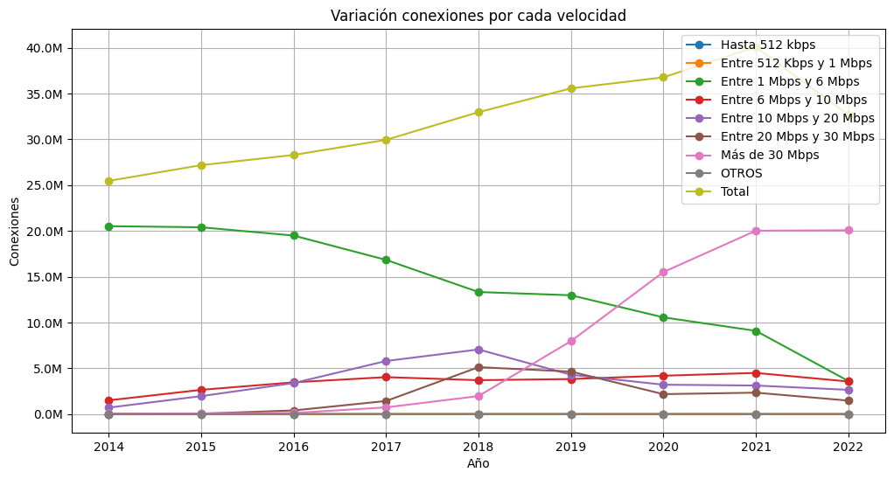 La velocidad de conexión preferida por los usuarios se sitúa por arriba de los 30Mbps

El análisis revela un crecimiento significativo en las conexiones de internet con velocidades superiores a 30 Mbps en los últimos años. Esta tendencia debe ser considerada al desarrollar estrategias de penetración en el mercado para el servicio de internet fijo por banda ancha. Es importante destacar que los usuarios demandan velocidades más altas, lo que sugiere la necesidad de ofrecer una conexión rápida y estable para satisfacer sus necesidades

### * **Tecnologías de conectividad**

   - La conectividad por fibra óptica ha experimentado un crecimiento significativo y está reemplazando a otras tecnologías.
   - Entre los años 2018 y 2019, la fibra óptica creció cerca de un 200%, mientras que las tecnologías de menor velocidad disminuyeron.
   - Entre el año 2021 y 2022, las conexiones por cablemodem tuvieron una caída del -30%, mientras que las conexiones de fibra óptica crecieron en la misma medida.

   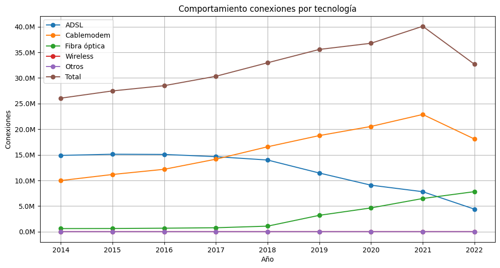 De la mano del crecimiento de la velocidad de internet superior a 30Mbps, la tecnología de conexión de mayor uso a nivel nacional son el Cablemodem y la Fibra óptica.

   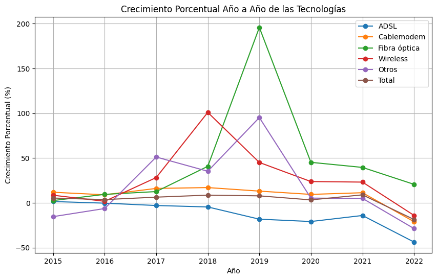 Crecimiento de las tecnologías de banda ancha

La conectividad por fibra óptica ha experimentado un crecimiento notable y ha reemplazado gradualmente a otras tecnologías. Entre los años 2018 y 2019, la fibra óptica creció alrededor del 200%, mientras que las tecnologías de menor velocidad experimentaron una disminución. Entre 2021 y 2022, las conexiones por cablemodem sufrieron una caída del -30%, mientras que las conexiones de fibra óptica continuaron creciendo. Estos resultados sugieren que la empresa debe considerar invertir en infraestructura de fibra óptica para mantenerse actualizada con la demanda del mercado y ofrecer tecnología de punta a sus clientes.

### * **Inversión en infraestructura de fibra óptica**

   - Se sugiere que la empresa revise la posibilidad de invertir en infraestructura de fibra óptica para ingresar exitosamente al mercado del internet fijo por banda ancha.
   - La tecnología de fibra óptica ofrece velocidades de internet preferidas en los últimos años, por lo que es importante ofrecer esta tecnología de punta.

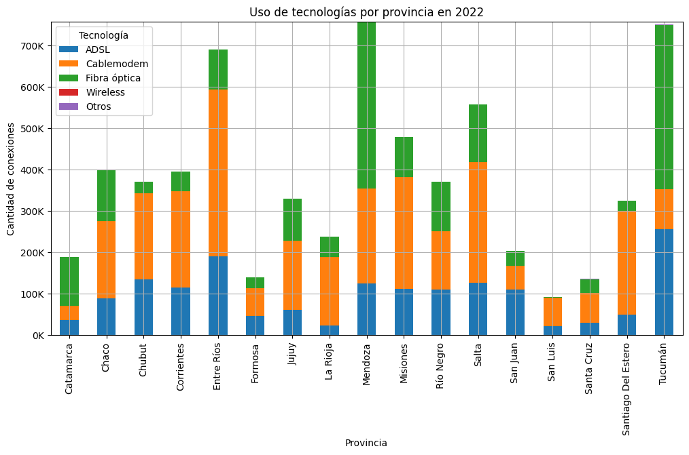 Analiazando el uso de tecnologías para conexión a internet en las 17 provincias con menor penetración, encontramos que el Cablemodem y la fibra óptica son las principales.

### * **Ingresos por la Prestación del Servicio**

- Entre 2017 y 2020, los ingresos por la prestación del servicio experimentaron un crecimiento anual superior al 45%.
- A medida que la penetración del servicio de internet fijo en Argentina aumenta, se espera que el crecimiento porcentual de los ingresos sea menor en los próximos años.

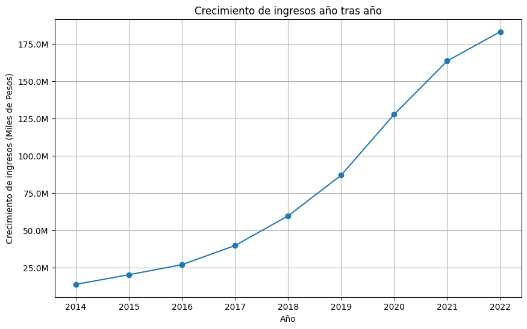 Los ingresos por la prestación del servicio tienen una clara tendencia de crecimiento a través de los años. Sin embargo es importante verificar el porcentaje de crecimiento de cada año y compararlo historicamente.

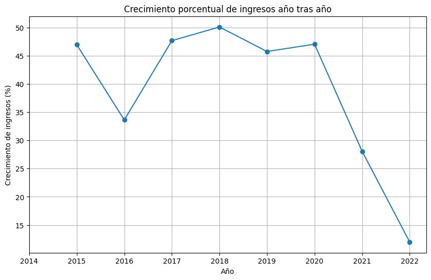 La variación año a año de los ingresos decreció aceleradamente en los últimos años. En otras palabras, los ingresos del sector experimentaron un crecimiento cada vez más lento o incluso una disminución en su aumento a lo largo del tiempo.

Durante el período comprendido entre 2017 y 2020, los ingresos por la prestación del servicio experimentaron un crecimiento anual superior al 45%. Sin embargo, se espera que el crecimiento porcentual de los ingresos disminuya en los próximos años a medida que la penetración del servicio de internet fijo en Argentina se expanda. Esto puede atribuirse a la madurez del mercado y a la alta competencia en el sector. Es fundamental que la empresa ajuste su estrategia comercial y busque oportunidades de crecimiento en otros segmentos o mediante servicios personalizados.

### * **Viviendas sin internet**

   - En el año 2022, se identificaron 4.677.266 viviendas sin acceso a internet, lo que representa el 26% del total.
   - Solo en la provincia de Buenos Aires, hay 1.522.728 viviendas sin internet, lo que corresponde al 35% del total de viviendas sin acceso a internet.

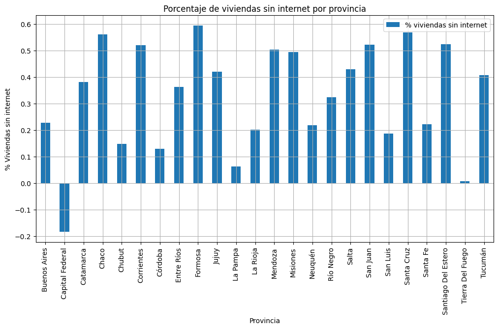 Encontramos en este gráfico las provincias con su respectivo porcentaje de viviendas sin internet. Si bien la Provincia de Buenos Aires tiene un porcentaje que podría considerarse bajo respecto de la media, es en donde se concentran más hogares concentrados, por lo que representa una importante cuota de mercado. **Se encuentra una cuota de mercado importante a la que se puede llegar en Argentina, teniendo en cuenta que el 26% de los hogares aún no cuentan con acceso a internet.**

En el año 2022 se identificaron 4.677.266 viviendas en Argentina sin acceso a internet, lo que representa el 26% del total de hogares. Es importante destacar que solo en la provincia de Buenos Aires se registran 1.522.728 viviendas sin internet, lo que corresponde al 35% del total de viviendas sin acceso a internet. Por lo que además de las 17 provincias con penetración inferior al 60%, la provincia de Buenos Aires tiene una buena porción de mercado por ser captado.

## Conclusiones

El análisis completo realizado ha proporcionado información valiosa sobre el comportamiento del sector de la conexión a internet fijo en Argentina. Los indicadores clave de rendimiento (KPIs) permiten a la empresa identificar áreas de mejora en la prestación del servicio, oportunidades de crecimiento y plantear soluciones personalizadas para sus posibles clientes. Para mantenerse competitiva en el mercado y brindar una buena calidad de servicios, es esencial que la empresa priorice la mejora de infraestructura, amplíe la conectividad y ofrezca tecnologías de vanguardia, como la fibra óptica, para satisfacer las demandas de los usuarios y seguir creciendo en el futuro.

¡Gracias por su atención!

[Adjunto: Notebook con el EDA](EDA.ipynb)
